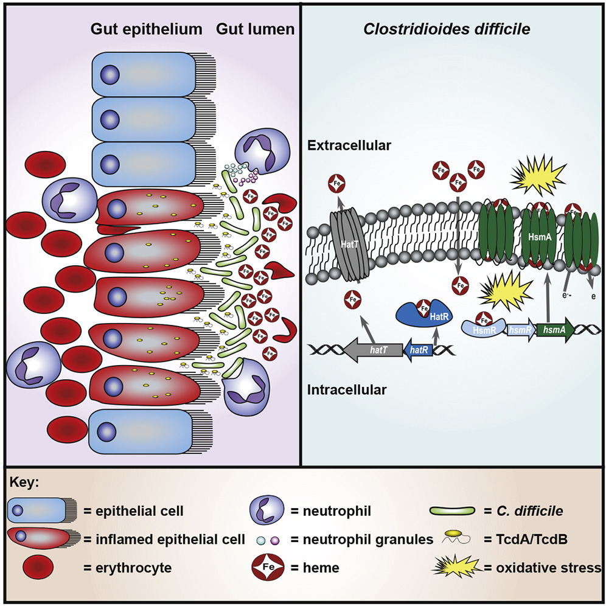
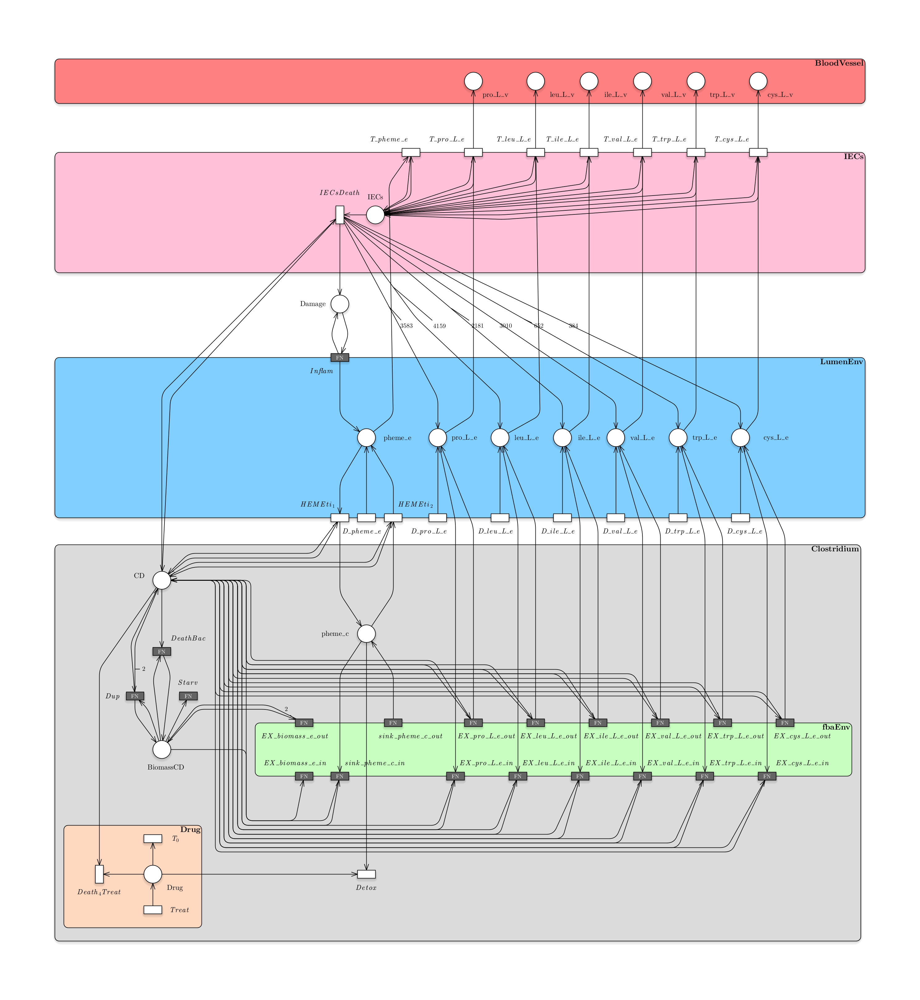
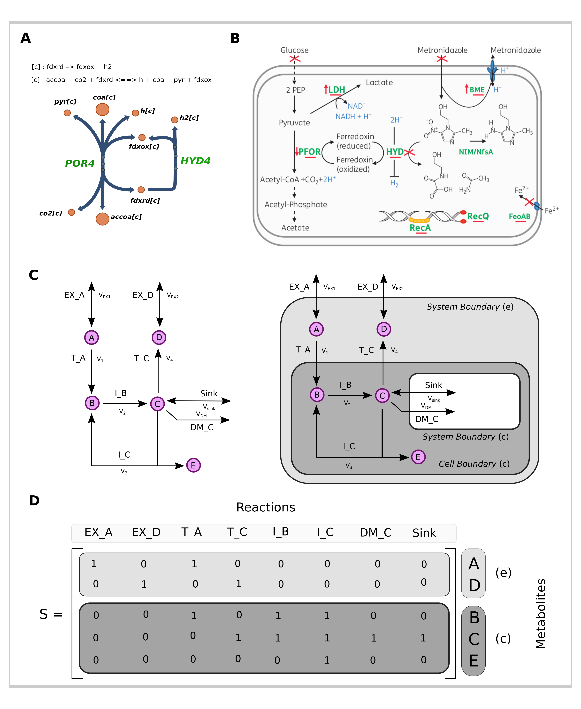

<style type="text/css">

body{ /* Normal  */ font-size: 14px; font-family: "Times New Roman"}
body{text-align: justify}
td{  /* Table  */ font-size: 12px; font-family: "Times New Roman"}

h1.title {font-size:28px}
h1 { /* Header 1 */ font-size: 22px}
h2 { /* Header 2 */ font-size: 20px}
h3 { /* Header 3 */ font-size: 18px}

code.r{ /* Code block */font-size: 6px;}
pre { /* Code block - determines code spacing between lines */font-size:10px;}

p.caption {
  font-size: 0.85em;
  font-style: normal;
  color: black;
  margin-top: 1em;
  margin-right: 4%;
  margin-left: 4%;  
  text-align: justify;
}

</style>

## Background

```{r, echo= FALSE, results='hide', message=FALSE}
library(flextable)
library(tidyverse)
library(dplyr)
library(kableExtra)
library(patchwork)
library(ggplot2)
```

*C. difficile* can utilize heme from the host to protect against antibiotic therapy and immune cell mediated oxidative stress produced at the host-pathogen interface. __HatRT__ system in *C. difficile* senses and detoxifies excess intracellular heme through efflux. The results herein further refine our current model of heme homeostasis in  *C. difficile*, Figure 1. 

```{r, echo=FALSE, fig.align='center', fig.cap="Fig. 1. C. difficile senses and hijacks host heme for incorporation into an oxidative stress defense system. This effect would presumably be related to the ability of heme to detoxify the nitro-radicals generated by metronidazole activation", out.width = '75%'}

```

*HsmR* senses low concentrations of heme and activates expression of the __hsmRA__ operon which leads to the integration of heme into *HsmA*. Heme-bound HsmA within the membrane shields the bacterium against redox active molecules. Concurrently, HatR binds heme, derepressing the __hatRT__ operon, leading to subsequent efflux of free heme through HatT, and resulting in a relief from heme toxicity. Together these systems function to maintain a tolerable concentration of intracellular heme for *C. difficile* to protect itself against the stressors encountered within the host during CDI [[2]](https://pubmed.ncbi.nlm.nih.gov/32526159/).

## Adding target reactions to the model

Starting from the published *C. difficile* genome-scale metabolic networks [CD196](https://github.com/VirtualMetabolicHuman/AGORA/tree/master/CurrentVersion/AGORA_1_03/AGORA_1_03_mat) We inserted heam transport reactions as reversible (while originally *C. bifermentans* metabolic model they were compiled as irreversible). Referencing to the script *Building_Model.m*. It will apply the method *addReactionGEM_Unito.m*.

### CD196 -> CD196HemeEXs

Specifying reactions: 

* _EX_pheme(e)_ : *[e] : pheme <==> *
* _HEMEti_ : *atp[c] + h2o[c] + pheme[e] <==> adp[c] + h[c] + pheme[c] + pi[c]*

```{r, echo=FALSE, warning=FALSE}

# source("./code/DataPreprocessing.R")
# modelProcessing(path = "./data/CD196_heme/CD196_heme.mat", model.name = "CD196_heme")
load("/home/riccardo/Documents/ClostridiumDiff_FBAandPN/EpiCell_CDifficile/Input/CDmodels/CD196HemeEXs/CD196_heme.RData")
```

Checking out for reactions included in this model.

```{r, message=FALSE, echo=FALSE, tab.id="test"}

BIGGdataCD196Reactions = readr::read_delim("/home/riccardo/Documents/ClostridiumDiff_FBAandPN/EpiCell_CDifficile/Input/CDmodels/CD196HemeEXs/BIGGdata_CD196_heme_react.tsv", delim = "\t", escape_double = FALSE, trim_ws = TRUE)

source("/home/riccardo/Documents/ClostridiumDiff_FBAandPN/EpiCell_CDifficile/Rfunction/findReactEq.R")

HemeAllReactions = rbind(findReactEq(model = model.mat, 
                                     metadata = BIGGdataCD196Reactions, reagent= "pheme[e]"),
                         findReactEq(model = model.mat, 
                                     metadata = BIGGdataCD196Reactions, reagent = "pheme[c]"))

HemeAllReactions = cbind(HemeAllReactions, 
                         model.mat@lowbnd[HemeAllReactions$...1],
                         model.mat@uppbnd[HemeAllReactions$...1])

colnames(HemeAllReactions) = c("ReactionIndex", "ReactionName", "ReactionBIGG", 
                               "ReactionEQ", "Lb", "Ub")

kbl(HemeAllReactions[-5, ], escape = F) %>%
  kable_styling(latex_option = c("hold_position")) %>% 
                  kable_paper("striped", full_width = F)

```

### CD196 -> CD196HemeSink

We edit the original published model [CD196](https://github.com/VirtualMetabolicHuman/AGORA/tree/master/CurrentVersion/AGORA_1_03/AGORA_1_03_mat) to include the reversible sink reaction for heme. This sink reaction is of great use for those compounds produced or consumed by non-metabolic cellular processes (see _Appendix A: Looking for model boundary reactions_ for more details about sink reactions and the other so called boundary reactions and thier implications on the final model). We also edit the original model deleting those reactions involving extracellular heme. However, these reactions are not permanently lost since they are added later to the final model through the Petri Net formalism. 

Specyfing reactions:

* _sink_pheme(c)_ : *[c] : pheme <==> *

```{r, echo=FALSE, warning=FALSE}
# source("./code/DataPreprocessing.R")
# modelProcessing(path = "./data/CD196_heme/CD196_heme.mat", model.name = "CD196_heme")
load("/home/riccardo/Documents/ClostridiumDiff_FBAandPN/EpiCell_CDifficile/Input/CDmodels/CD196HemeSink/CD196HemeSink.RData")
```

Checking out for reactions included in this model.

```{r, message=FALSE, echo=FALSE, tab.id="test"}

BIGGdataCD196HemeSink = readr::read_delim("/home/riccardo/Documents/ClostridiumDiff_FBAandPN/EpiCell_CDifficile/Input/CDmodels/CD196HemeSink/BIGGdata_CD196HemeSink_react.tsv", delim = "\t", 
                                          escape_double = FALSE, trim_ws = TRUE)

source("/home/riccardo/Documents/ClostridiumDiff_FBAandPN/EpiCell_CDifficile/Rfunction/findReactEq.R")

HemeAllReactions = rbind(findReactEq(model = model.mat, metadata = BIGGdataCD196HemeSink, reagent= "pheme[e]"),
                         findReactEq(model = model.mat, metadata = BIGGdataCD196HemeSink, reagent = "pheme[c]"))

HemeAllReactions = cbind(HemeAllReactions, 
                         model.mat@lowbnd[HemeAllReactions$...1],
                         model.mat@uppbnd[HemeAllReactions$...1])

colnames(HemeAllReactions) = c("ReactionIndex", "ReactionName", "ReactionBIGG", 
                               "ReactionEQ", "Lb", "Ub")

kbl(HemeAllReactions[-5, ], escape = F) %>%
  kable_styling(latex_option = c("hold_position")) %>% 
                  kable_paper("striped", full_width = F)

```

## The CDI infection model

The CDI infection Petri Net model is composed by *places* (graphically represented by circles) corresponding to epithelial cells, bacterial biomass, metabolites and tissue state (i.e. damage to the colonic mucosa) and by *transitions* (graphically represented by rectangles) corresponding to the interactions among the entities, cellular death, intake or efflux of metabolites, toxin action, intestinal inflammation and drug
activity. 

The model is composed by five modules: *IECs*, *LumenEnv*, *FbaEnv*, *Drug*, *BloodVessel*.

```{r, echo=FALSE, fig.align='center', fig.cap="Fig. 3. Caption Figure 3", out.width = '100%'}

```

## Testing CD196SinkHeme model alone

Lets first compile the metabolic model from the *.RData* storing the chemical reaction network, and then generate a flux distribution to test the optimization of the mathematical programming object.

```{r, echo=FALSE, warning=FALSE, results = FALSE, message = FALSE}

# source("/home/riccardo/Documents/ClostridiumDiff_FBAandPN/EpiCell_CDifficile/Input/notes/FBAGeneration.R")
# FBA.generation(model = "./Input/CDmodels/CD196HemeSink/CD196HemeSink.RData", write = T)
# FBA.generation() compiles FBAmodel files which is the model included in the final CDI model
load("/home/riccardo/Documents/ClostridiumDiff_FBAandPN/EpiCell_CDifficile/Input/CDmodels/CD196HemeSink/CD196HemeSink.RData")
```

We exploited *flux_balance()* method to perform sensitivity analysis acting on the permissible flux through target reactions (flux distribution is obtained through running parsimonious FBA or minimum total flux (MTF)). 

```{r, echo=FALSE, warning=FALSE, results = FALSE, message = FALSE}
source("/home/riccardo/Documents/ClostridiumDiff_FBAandPN/EpiCell_CDifficile/Rfunction/flux_balance.R")
```

We also exploited *flux_balance_fba()* method to perform sensitivity analysis acting on the permissible flux through target reactions (flux distribution is obtained through running FBA).

```{r, echo=FALSE, warning=FALSE, results = FALSE, message = FALSE}
source("/home/riccardo/Documents/ClostridiumDiff_FBAandPN/EpiCell_CDifficile/Rfunction/flux_balance_fba.R")
```

```{r, echo=FALSE, results = FALSE, warning=FALSE}
load("/home/riccardo/Documents/ClostridiumDiff_FBAandPN/EpiCell_CDifficile/Input/CDmodels/CD196HemeSink/CD196HemeSink.RData")

set.seed(1234)

P = c(1e-350, round(sort(runif(18, min = 0.001, max = 0.15)), 5))

FBA.allScenarios = list()

Sink = ("sink_pheme(c)")
EXs = c("EX_pro_L(e)", "EX_leu_L(e)", "EX_ile_L(e)", 
        "EX_val_L(e)", "EX_trp_L(e)", "EX_cys_L(e)")

EX_biomass = c(); EX_pro = c(); EX_leu = c();  EX_ile = c()
EX_val = c(); EX_trp = c(); EX_cys = c(); Sink_heme = c()

# for (i in 1:length(P)) {
  
  # Lb
  # model.mat@lowbnd[which(model.mat@react_id %in% EXs)] = 
    # model.mat@lowbnd[which(model.mat@react_id %in% EXs)] * P[i]
  # Ub
  # model.mat@uppbnd[which(model.mat@react_id %in% EXs)] = 
    # model.mat@uppbnd[which(model.mat@react_id %in% EXs)] * P[i]
  
  # cat("                                                               ", "\n")
  # cat("lowbnd:", sybil::lowbnd(model.mat)[which(model.mat@react_id %in% EXs)])
  # cat("                                                               ", "\n")
  # cat("uppbnd:", sybil::uppbnd(model.mat)[which(model.mat@react_id %in% EXs)])
  # cat("                                                               ", "\n")
  
  # FBA solutions
  # mtf_sol = flux_balance(model = model.mat, typename = model.mat@mod_desc, diet = F)
  
  # FBA.allScenarios[[i]] = list(mtf_sol = mtf_sol, 
                               # lb = sybil::lowbnd(model.mat),
                               # ub = sybil::uppbnd(model.mat))
  
  # v = mtf_sol[[1]][["fluxes"]]
  
  # EX_biomass[i] = v[which(model.mat@react_id == "EX_biomass(e)")]
  
  # EX_pro[i] = v[which(model.mat@react_id == "EX_pro_L(e)")]
  # EX_leu[i] = v[which(model.mat@react_id == "EX_leu_L(e)")]
  # EX_ile[i] = v[which(model.mat@react_id == "EX_ile_L(e)")]
  # EX_val[i] = v[which(model.mat@react_id == "EX_val_L(e)")]
  # EX_trp[i] = v[which(model.mat@react_id == "EX_trp_L(e)")]
  # EX_cys[i] = v[which(model.mat@react_id == "EX_cys_L(e)")]
  
  # Sink_heme[i] = v[which(model.mat@react_id == "sink_pheme(c)")]
  
  # load("/home/riccardo/Documents/ClostridiumDiff_FBAandPN/EpiCell_CDifficile/Input/CDmodels/CD196HemeSink/CD196HemeSink.RData")
  
# }

# objdatafba = data.frame(EX_biomass, EX_pro, EX_leu, EX_ile, 
#                      EX_val, EX_trp, EX_cys, Sink_heme, 
#                      BoundsActivity = P)

# objdatafba = tidyr::gather(objdatafba, key, Value, -BoundsActivity)

# save(objdatafba, file = "/home/riccardo/Documents/ClostridiumDiff_FBAandPN/EpiCell_CDifficile/Input/CDmodels/CD196HemeSink/objdatafba.RData")

load("~/Documents/ClostridiumDiff_FBAandPN/EpiCell_CDifficile/Input/CDmodels/CD196HemeSink/objdatafba.RData")

EXfba = ggplot2::ggplot(objdatafba, ggplot2::aes(x = BoundsActivity, y = Value, color = key)) + 
  ggplot2::geom_line() + ggplot2::ylim(-150, 150) + 
  ggplot2::geom_vline(xintercept = P, linetype="dotted") +
  ggplot2::geom_point(col = "black", shape = 21, size = 1) +
  ggplot2::theme(axis.title = ggplot2::element_text(size = 12), 
                 plot.title = ggplot2::element_text(size = 12),
                 axis.text = ggplot2::element_text(size = 10),
                 legend.key.size = ggplot2::unit(0.35, 'cm'),
                 legend.title=ggplot2::element_text(size = 10), 
                 legend.text=ggplot2::element_text(size = 10),
                 axis.title.x = ggplot2::element_text(color = "black", size = 12),
                 axis.title.y = ggplot2::element_text(color = "black", size = 12)) +
  ggplot2::scale_colour_discrete(name="Target Reactions") +
  ggplot2::ggtitle("Changing bounds Test (essential AAs): algo = FBA") + 
  ggplot2::labs(y = "Flux [mmol/h*gDW]", x = "Bounds activity [x*lb; x*up]")
```

```{r, echo=FALSE, results = FALSE, warning=FALSE, message=F}

load("/home/riccardo/Documents/ClostridiumDiff_FBAandPN/EpiCell_CDifficile/Input/CDmodels/CD196HemeSink/CD196HemeSink.RData")

set.seed(1234)

source("/home/riccardo/Documents/ClostridiumDiff_FBAandPN/EpiCell_CDifficile/Rfunction/flux_balance.R")
# FBA.generation(model = "./Input/CDmodels/CD196HemeSink/CD196HemeSink.RData", write = T)
load("/home/riccardo/Documents/ClostridiumDiff_FBAandPN/EpiCell_CDifficile/Input/CDmodels/CD196HemeSink/CD196HemeSink.RData")

Sink = ("sink_pheme(c)")
EXs = c("EX_pro_L(e)", "EX_leu_L(e)", "EX_ile_L(e)", 
        "EX_val_L(e)", "EX_trp_L(e)", "EX_cys_L(e)")

# P = c(0.0, 0.001, 0.003, 0.005, 0.008, 0.015, 0.03, 0.05)
P = c(0.0, round(sort(runif(18, min = 0.001, max = 0.15)), 5))
FBA.allScenarios = list()

EX_biomass = c(); EX_pro = c(); EX_leu = c();  EX_ile = c()
EX_val = c(); EX_trp = c(); EX_cys = c(); Sink_heme = c()

# for (i in 1:length(P)) {
  
  # Lb
  # model.mat@lowbnd[which(model.mat@react_id %in% EXs)] = 
    # model.mat@lowbnd[which(model.mat@react_id %in% EXs)] * P[i]
  # Ub
  # model.mat@uppbnd[which(model.mat@react_id %in% EXs)] = 
    # model.mat@uppbnd[which(model.mat@react_id %in% EXs)] * P[i]
  
  # cat("                                                               ", "\n")
  # cat("lowbnd:", sybil::lowbnd(model.mat)[which(model.mat@react_id %in% EXs)])
  # cat("                                                               ", "\n")
  # cat("uppbnd:", sybil::uppbnd(model.mat)[which(model.mat@react_id %in% EXs)])
  # cat("                                                               ", "\n")
  
  # FBA solutions
  # mtf_sol = flux_balance(model = model.mat, typename = model.mat@mod_desc, diet = F)
  
  # FBA.allScenarios[[i]] = list(mtf_sol = mtf_sol, 
                               # lb = sybil::lowbnd(model.mat),
                               # ub = sybil::uppbnd(model.mat))
  
  # v = sybil::getFluxDist(mtf_sol[[1]])
  
  # EX_biomass[i] = v[which(model.mat@react_id == "EX_biomass(e)")]
  
  # EX_pro[i] = v[which(model.mat@react_id == "EX_pro_L(e)")]
  # EX_leu[i] = v[which(model.mat@react_id == "EX_leu_L(e)")]
  # EX_ile[i] = v[which(model.mat@react_id == "EX_ile_L(e)")]
  # EX_val[i] = v[which(model.mat@react_id == "EX_val_L(e)")]
  # EX_trp[i] = v[which(model.mat@react_id == "EX_trp_L(e)")]
  # EX_cys[i] = v[which(model.mat@react_id == "EX_cys_L(e)")]
  
  # Sink_heme[i] = v[which(model.mat@react_id == "sink_pheme(c)")]
  
  # load("/home/riccardo/Documents/ClostridiumDiff_FBAandPN/EpiCell_CDifficile/Input/CDmodels/CD196HemeSink/CD196HemeSink.RData")
  
# }

# objdatamtf = data.frame(EX_biomass, EX_pro, EX_leu, EX_ile, 
                     # EX_val, EX_trp, EX_cys, Sink_heme, 
                     # BoundsActivity = P)

# objdatamtf = tidyr::gather(objdatamtf, key, Value, -BoundsActivity)

# save(objdatamtf, file = "/home/riccardo/Documents/ClostridiumDiff_FBAandPN/EpiCell_CDifficile/Input/CDmodels/CD196HemeSink/objdatamtf.RData")

load("~/Documents/ClostridiumDiff_FBAandPN/EpiCell_CDifficile/Input/CDmodels/CD196HemeSink/objdatamtf.RData")

EXmtf = ggplot2::ggplot(objdatamtf, ggplot2::aes(x = BoundsActivity, y = Value, color = key)) + 
  ggplot2::geom_line() + ggplot2::ylim(-150, 150) + 
  ggplot2::geom_vline(xintercept = P, linetype="dotted") +
  ggplot2::geom_point(col = "black", shape = 21, size = 1) +
  ggplot2::theme(axis.title = ggplot2::element_text(size = 12), 
                 plot.title = ggplot2::element_text(size = 12),
                 axis.text = ggplot2::element_text(size = 10),
                 legend.key.size = ggplot2::unit(0.35, 'cm'),
                 legend.title=ggplot2::element_text(size = 10), 
                 legend.text=ggplot2::element_text(size = 10),
                 axis.title.x = ggplot2::element_text(color = "black", size = 12),
                 axis.title.y = ggplot2::element_text(color = "black", size = 12)) +
  ggplot2::scale_colour_discrete(name="Target Reactions") +
  ggplot2::ggtitle("Changing bounds Test (essential AAs): algo = FBA && MTF") + 
  ggplot2::labs(y = "Flux [mmol/h*gDW]", x = "Bounds activity [x*lb; x*up]")
```

```{r, echo=FALSE, results = FALSE, warning=FALSE, message=FALSE, out.width="50%"}
EXfba
EXmtf
```

Also, we evaluate the estimanted flux solving LPs through GLPK called within __epimod__ framework.

```{r, echo=FALSE, results = FALSE, warning=FALSE, message=F}

# library(devtools)
# install_github("https://github.com/qBioTurin/epimod", ref="master")

# library(epimod)
# library(dplyr)

# Lets compile the metabolic model from the RData storing the chemical reaction network

# source("Rfunction/Functions.R")
# FBA.generation(model = "./Input/CDmodels/CD196HemeSink/CD196HemeSink.RData", write = T)

# Sensitivity analysis on Bounds (sampled values)

# model.generation(net_fname = "./Net/EpitCellDifficileHemeSink.PNPRO",
#                  transitions_fname = "./Net/ConstantBoundsSinkHeme.cpp",
#                  LP = T)

# system("mv EpitCellDifficileHemeSink.* ./Net")

set.seed(1234)

FluxVec = c("EX_biomass.e.", 
            "sink_pheme.c.", 
            "EX_cys_L.e.", "EX_trp_L.e.", "EX_val_L.e.", 
            "EX_ile_L.e.", "EX_leu_L.e.", "EX_pro_L.e.")

P = c(1e-350, round(sort(runif(18, min = 0.001, max = 0.15)), 5))

# SensitivityDataGLPK = data.frame()

# for (i in 1:length(P)) {
  
#  model.analysis(solver_fname = "./Net/EpitCellDifficileHemeSink.solver",
#                 i_time = 0, f_time = 2, s_time = 1, 
#                 parameters_fname = "Input/csv/ParametersListSinkHeme.csv",
#                 functions_fname = "Rfunction/Functions.R", 
#                 ini_v = c(# h = 0.5 half-life each hour
#                   0.5, 
#                   # IECsDeath = 1e-10
#                   1e-10, 
#                   # P
#                   P[i],
#                   i,
#                   s_time = 1),
#                 debug = T)
  
#  FluxPath = paste("./EpitCellDifficileHemeSink_analysis/EpitCellDifficileHemeSink-analysis-00", 
#              i,".trace", sep = "")
  
#  subflux = read.table(FluxPath, header = T, sep = ";") %>% 
#    select(FluxVec, Time) %>% 
#    tidyr::gather(key = "Reaction", value = "Flux", -Time)
  
#  scenario = rep(P[i], length(subflux$Time))
#  subflux = cbind(subflux, scenario)
  
#  SensitivityDataGLPK = rbind(SensitivityDataGLPK, subflux)
# }

# save(SensitivityDataGLPK, file = "./Input/CDmodels/CD196HemeSink/SensitivityDataGLPK.RData")

load("/home/riccardo/Documents/ClostridiumDiff_FBAandPN/EpiCell_CDifficile/Input/CDmodels/CD196HemeSink/SensitivityDataGLPK.RData")

SensitivityDataGLPK = SensitivityDataGLPK[, -1] %>% distinct()
colnames(SensitivityDataGLPK) = c("key", "Value", "BoundsActivity")

# system("rm *.log")

EXfbaGLPK = ggplot2::ggplot(SensitivityDataGLPK, ggplot2::aes(x = BoundsActivity, y = Value, color = key)) +
  ggplot2::geom_line() + ggplot2::ylim(-150, 150) +
  ggplot2::geom_vline(xintercept = P, linetype="dotted") +
  ggplot2::geom_point(col = "black", shape = 21, size = 1) +
  ggplot2::theme(axis.title = ggplot2::element_text(size = 12), 
                 plot.title = ggplot2::element_text(size = 12),
                 axis.text = ggplot2::element_text(size = 10),
                 legend.key.size = ggplot2::unit(0.35, 'cm'),
                 legend.title=ggplot2::element_text(size = 10), 
                 legend.text=ggplot2::element_text(size = 10),
                 axis.title.x = ggplot2::element_text(color = "black", size = 12),
                 axis.title.y = ggplot2::element_text(color = "black", size = 12)) +
  ggplot2::scale_colour_discrete(name="Target Reactions") +
  ggplot2::ggtitle("Changing bounds Test (essential AAs): algo = GLPK (from epimod)") + 
  ggplot2::labs(y = "Flux [mmol/h*gDW]", x = "Bounds activity [x*lb; x*up]")

```

```{r, echo=FALSE, results = FALSE, warning=FALSE, message=FALSE, out.width="75%", fig.align='center'}
EXfbaGLPK
```

## FBA solution space is explored by Boundary Reactions bounds variation.

Apparently reactions "EX_leu_L(e)" and "EX_pro_L(e)" and "EX_val_L(e)" showed unexpected behaviour. EX_pro_L(e) is always 0 whereas EX_leu_L(e) is always positive. Therefore, we are going to expore the solution ladscape for "EX_leu_L(e)" and "EX_pro_L(e)" "EX_val_L(e)" reactions flux estimations.

```{r, echo=FALSE, results = FALSE, warning=FALSE, message=FALSE}

source("/home/riccardo/Documents/ClostridiumDiff_FBAandPN/EpiCell_CDifficile/Rfunction/SensitivityAnalysis.R")

seed = 1234
combinations = 15000
```

```{r, echo=FALSE, results = FALSE, warning=FALSE, message=FALSE}

# load("~/Documents/ClostridiumDiff_FBAandPN/EpiCell_CDifficile/Input/CDmodels/CD196/CD196.RData")

# SensitivityDataFBAStandard = SensitivityAnalysis(seed = seed, combinations = combinations, algo = "fba",
#                                                  model = "CD196", verbose = T,
#                                                  sink = F, distr = "runif", mean = 100, sd = pi*25,
#                                                  minBound = 1e-18, maxBound = 1000)

load("~/Documents/ClostridiumDiff_FBAandPN/EpiCell_CDifficile/Input/CDmodels/CD196/SensitivityDatafbarunif.RData")
  
means <- aggregate(Value ~ key, SensitivityData, "mean")
max <- aggregate(Value ~  key, SensitivityData, "max")
min <- aggregate(Value ~  key, SensitivityData, "min")
  
means$Value = round(means$Value, 2)
max$Value = round(max$Value, 2)
min$Value = round(min$Value, 2)

fba_standard = ggplot(data = SensitivityData, aes(x=key, y=Value, fill=key)) + 
  geom_boxplot() + stat_summary(fun=mean, colour="darkred", geom="point", 
                                shape=18, size=3, show.legend=FALSE) +
  geom_text(data = min, aes(label = Value, y = Value - 100)) +
  geom_text(data = max, aes(label = Value, y = Value + 100)) +
  viridis::scale_color_viridis(discrete = TRUE) +
  ggplot2::ggtitle(paste("Flux obtained from", combinations, "combinations: algo = FBA")) +
  hrbrthemes::theme_ipsum() +
  ggplot2::ylab("Estimated Fluxes [mmol/gDW*h]") +
  ggplot2::xlab("Reactions") +
  ggplot2::theme(axis.title = ggplot2::element_text(size = 12), 
                 plot.title = ggplot2::element_text(size = 12),
                 axis.text = ggplot2::element_text(size = 10),
                 legend.key.size = ggplot2::unit(0.35, 'cm'),
                 legend.title=ggplot2::element_text(size = 10), 
                 legend.text=ggplot2::element_text(size = 10),
                 axis.title.x = ggplot2::element_text(color = "black", size = 12),
                 axis.text.x = ggplot2::element_text(size = 10),
                 axis.title.y = ggplot2::element_text(color = "black", size = 12))

# load("~/Documents/ClostridiumDiff_FBAandPN/EpiCell_CDifficile/Input/CDmodels/CD196/CD196.RData")

# SensitivityDataMTFStandard = SensitivityAnalysis(seed = seed, combinations = combinations, algo = "mtf",
#                                                  model = "CD196", verbose = T,
#                                                  sink = F, distr = "runif", mean = 100, sd = pi*25,
#                                                  minBound = 1e-18, maxBound = 1000)

load("~/Documents/ClostridiumDiff_FBAandPN/EpiCell_CDifficile/Input/CDmodels/CD196/SensitivityDatamtfrunif.RData")

means <- aggregate(Value ~ key, SensitivityData, "mean")
max <- aggregate(Value ~  key, SensitivityData, "max")
min <- aggregate(Value ~  key, SensitivityData, "min")
  
means$Value = round(means$Value, 2)
max$Value = round(max$Value, 2)
min$Value = round(min$Value, 2)

mtf_standard = ggplot(data = SensitivityData, aes(x=key, y=Value, fill=key)) + 
  geom_boxplot() + stat_summary(fun=mean, colour="darkred", geom="point", 
                                shape=18, size=3, show.legend=FALSE) +
  geom_text(data = min, aes(label = Value, y = Value - 100)) +
  geom_text(data = max, aes(label = Value, y = Value + 100)) +
  viridis::scale_color_viridis(discrete = TRUE) +
  ggplot2::ggtitle(paste("Flux obtained from", combinations, "combinations: algo = MTF")) +
  hrbrthemes::theme_ipsum() +
  ggplot2::ylab("Estimated Fluxes [mmol/gDW*h]") +
  ggplot2::xlab("Reactions") +
  ggplot2::theme(axis.title = ggplot2::element_text(size = 12), 
                 plot.title = ggplot2::element_text(size = 12),
                 axis.text = ggplot2::element_text(size = 10),
                 legend.key.size = ggplot2::unit(0.35, 'cm'),
                 legend.title=ggplot2::element_text(size = 10), 
                 legend.text=ggplot2::element_text(size = 10),
                 axis.title.x = ggplot2::element_text(color = "black", size = 12),
                 axis.text.x = ggplot2::element_text(size = 10),
                 axis.title.y = ggplot2::element_text(color = "black", size = 12))

```

```{r, echo=FALSE, results = FALSE, warning=FALSE, message=FALSE}

# load("~/Documents/ClostridiumDiff_FBAandPN/EpiCell_CDifficile/Input/CDmodels/CD196HemeSink/CD196HemeSink.RData")

# SensitivityDataFBASink = SensitivityAnalysis(seed = seed, combinations = combinations, algo = "fba",
#                                              model = "CD196HemeSink", verbose = T,
#                                              sink = T, distr = "runif", mean = 100, sd = pi*25,
#                                              minBound = 1e-18, maxBound = 1000)

load("~/Documents/ClostridiumDiff_FBAandPN/EpiCell_CDifficile/Input/CDmodels/CD196HemeSink/SensitivityDatafbarunif.RData")

means <- aggregate(Value ~ key, SensitivityData, "mean")
max <- aggregate(Value ~  key, SensitivityData, "max")
min <- aggregate(Value ~  key, SensitivityData, "min")
  
means$Value = round(means$Value, 2)
max$Value = round(max$Value, 2)
min$Value = round(min$Value, 2)

fba_sink = ggplot(data = SensitivityData, aes(x=key, y=Value, fill=key)) + 
  geom_boxplot() + stat_summary(fun=mean, colour="darkred", geom="point", 
                                shape=18, size=3, show.legend=FALSE) +
  geom_text(data = min, aes(label = Value, y = Value - 100)) +
  geom_text(data = max, aes(label = Value, y = Value + 100)) +
  viridis::scale_color_viridis(discrete = TRUE) +
  ggplot2::ggtitle(paste("Flux obtained from", combinations, "combinations (SinkHeme): algo = FBA")) +
  hrbrthemes::theme_ipsum() +
  ggplot2::ylab("Estimated Fluxes [mmol/gDW*h]") +
  ggplot2::xlab("Reactions") +
  ggplot2::theme(axis.title = ggplot2::element_text(size = 12), 
                 plot.title = ggplot2::element_text(size = 12),
                 axis.text = ggplot2::element_text(size = 10),
                 legend.key.size = ggplot2::unit(0.35, 'cm'),
                 legend.title=ggplot2::element_text(size = 10), 
                 legend.text=ggplot2::element_text(size = 10),
                 axis.title.x = ggplot2::element_text(color = "black", size = 12),
                 axis.text.x = ggplot2::element_text(size = 10),
                 axis.title.y = ggplot2::element_text(color = "black", size = 12))

# load("~/Documents/ClostridiumDiff_FBAandPN/EpiCell_CDifficile/Input/CDmodels/CD196HemeSink/CD196HemeSink.RData")

# SensitivityDataMTFSink = SensitivityAnalysis(seed = seed, combinations = combinations, algo = "mtf",
#                                              model = "CD196HemeSink", verbose = T,
#                                              sink = T, distr = "runif", mean = 100, sd = pi*25,
#                                              minBound = 1e-18, maxBound = 1000)

load("~/Documents/ClostridiumDiff_FBAandPN/EpiCell_CDifficile/Input/CDmodels/CD196HemeSink/SensitivityDatamtfrunif.RData")

means <- aggregate(Value ~ key, SensitivityData, "mean")
max <- aggregate(Value ~  key, SensitivityData, "max")
min <- aggregate(Value ~  key, SensitivityData, "min")
  
means$Value = round(means$Value, 2)
max$Value = round(max$Value, 2)
min$Value = round(min$Value, 2)

mtf_sink = ggplot(data = SensitivityData, aes(x=key, y=Value, fill=key)) + 
  geom_boxplot() + stat_summary(fun=mean, colour="darkred", geom="point", 
                                shape=18, size=3, show.legend=FALSE) +
  geom_text(data = min, aes(label = Value, y = Value - 100)) +
  geom_text(data = max, aes(label = Value, y = Value + 100)) +
  viridis::scale_color_viridis(discrete = TRUE) +
  ggplot2::ggtitle(paste("Flux obtained from", combinations, "combinations (SinkHeme): algo = MTF")) +
  hrbrthemes::theme_ipsum() +
  ggplot2::ylab("Estimated Fluxes [mmol/gDW*h]") +
  ggplot2::xlab("Reactions") +
  ggplot2::theme(axis.title = ggplot2::element_text(size = 12), 
                 plot.title = ggplot2::element_text(size = 12),
                 axis.text = ggplot2::element_text(size = 10),
                 legend.key.size = ggplot2::unit(0.35, 'cm'),
                 legend.title=ggplot2::element_text(size = 10), 
                 legend.text=ggplot2::element_text(size = 10),
                 axis.title.x = ggplot2::element_text(color = "black", size = 12),
                 axis.text.x = ggplot2::element_text(size = 10),
                 axis.title.y = ggplot2::element_text(color = "black", size = 12))
```

```{r, echo=FALSE, results = FALSE, warning=FALSE, message=FALSE, out.width="50%"}
fba_standard
fba_sink

mtf_standard
mtf_sink
```

```{r, echo=FALSE, results = FALSE, warning=FALSE, message=FALSE}

source("/home/riccardo/Documents/ClostridiumDiff_FBAandPN/EpiCell_CDifficile/Rfunction/SensitivityAnalysis.R")

seed = 1234
combinations = 5000
```

```{r, echo=FALSE, results = FALSE, warning=FALSE, message=FALSE}

# load("~/Documents/ClostridiumDiff_FBAandPN/EpiCell_CDifficile/Input/CDmodels/CD196/CD196.RData")

# SensitivityDataFBAStandard = SensitivityAnalysis(seed = seed, combinations = combinations, algo = "fba",
#                                                  model = "CD196", verbose = T,
#                                                  sink = F, distr = "rnorm", mean = 100, sd = pi*25,
#                                                  minBound = 1e-18, maxBound = 1000)

load("~/Documents/ClostridiumDiff_FBAandPN/EpiCell_CDifficile/Input/CDmodels/CD196/SensitivityDatafbarnorm.RData")
  
means <- aggregate(Value ~ key, SensitivityData, "mean")
max <- aggregate(Value ~  key, SensitivityData, "max")
min <- aggregate(Value ~  key, SensitivityData, "min")
  
means$Value = round(means$Value, 2)
max$Value = round(max$Value, 2)
min$Value = round(min$Value, 2)

fba_standard = ggplot(data = SensitivityData, aes(x=key, y=Value, fill=key)) + 
  geom_boxplot() + stat_summary(fun=mean, colour="darkred", geom="point", 
                                shape=18, size=3, show.legend=FALSE) +
  geom_text(data = min, aes(label = Value, y = Value - 100)) +
  geom_text(data = max, aes(label = Value, y = Value + 100)) +
  viridis::scale_color_viridis(discrete = TRUE) +
  ggplot2::ggtitle(paste("Flux obtained from", combinations, "combinations: algo = FBA")) +
  hrbrthemes::theme_ipsum() +
  ggplot2::ylab("Estimated Fluxes [mmol/gDW*h]") +
  ggplot2::xlab("Reactions") +
  ggplot2::theme(axis.title = ggplot2::element_text(size = 12), 
                 plot.title = ggplot2::element_text(size = 12),
                 axis.text = ggplot2::element_text(size = 10),
                 legend.key.size = ggplot2::unit(0.35, 'cm'),
                 legend.title=ggplot2::element_text(size = 10), 
                 legend.text=ggplot2::element_text(size = 10),
                 axis.title.x = ggplot2::element_text(color = "black", size = 12),
                 axis.text.x = ggplot2::element_text(size = 10),
                 axis.title.y = ggplot2::element_text(color = "black", size = 12))

# plot(sort(SensitivityDataFBAStandard$Value[which(SensitivityDataFBAStandard$key == "EX_biomass")]))

# load("~/Documents/ClostridiumDiff_FBAandPN/EpiCell_CDifficile/Input/CDmodels/CD196/CD196.RData")

# SensitivityDataMTFStandard = SensitivityAnalysis(seed = seed, combinations = combinations, algo = "mtf",
#                                                  model = "CD196", verbose = T,
#                                                  sink = F, distr = "rnorm", mean = 100, sd = pi*25,
#                                                  minBound = 1e-18, maxBound = 1000)

load("~/Documents/ClostridiumDiff_FBAandPN/EpiCell_CDifficile/Input/CDmodels/CD196/SensitivityDatamtfrnorm.RData")

means <- aggregate(Value ~ key, SensitivityData, "mean")
max <- aggregate(Value ~  key, SensitivityData, "max")
min <- aggregate(Value ~  key, SensitivityData, "min")
  
means$Value = round(means$Value, 2)
max$Value = round(max$Value, 2)
min$Value = round(min$Value, 2)

mtf_standard = ggplot(data = SensitivityData, aes(x=key, y=Value, fill=key)) + 
  geom_boxplot() + stat_summary(fun=mean, colour="darkred", geom="point", 
                                shape=18, size=3, show.legend=FALSE) +
  geom_text(data = min, aes(label = Value, y = Value - 100)) +
  geom_text(data = max, aes(label = Value, y = Value + 100)) +
  viridis::scale_color_viridis(discrete = TRUE) +
  ggplot2::ggtitle(paste("Flux obtained from", combinations, "combinations: algo = MTF")) +
  hrbrthemes::theme_ipsum() +
  ggplot2::ylab("Estimated Fluxes [mmol/gDW*h]") +
  ggplot2::xlab("Reactions") +
  ggplot2::theme(axis.title = ggplot2::element_text(size = 12), 
                 plot.title = ggplot2::element_text(size = 12),
                 axis.text = ggplot2::element_text(size = 10),
                 legend.key.size = ggplot2::unit(0.35, 'cm'),
                 legend.title=ggplot2::element_text(size = 10), 
                 legend.text=ggplot2::element_text(size = 10),
                 axis.title.x = ggplot2::element_text(color = "black", size = 12),
                 axis.text.x = ggplot2::element_text(size = 10),
                 axis.title.y = ggplot2::element_text(color = "black", size = 12))

# plot(sort(SensitivityDataMTFStandard$Value[which(SensitivityDataMTFStandard$key == "EX_biomass")]))

```

```{r, echo=FALSE, results = FALSE, warning=FALSE, message=FALSE}

# load("~/Documents/ClostridiumDiff_FBAandPN/EpiCell_CDifficile/Input/CDmodels/CD196HemeSink/CD196HemeSink.RData")

# SensitivityDataFBASink = SensitivityAnalysis(seed = seed, combinations = combinations, algo = "fba",
#                                              model = "CD196HemeSink", verbose = T,
#                                              sink = T, distr = "rnorm", mean = 100, sd = pi*25,
#                                              minBound = 1e-18, maxBound = 1000)

load("~/Documents/ClostridiumDiff_FBAandPN/EpiCell_CDifficile/Input/CDmodels/CD196HemeSink/SensitivityDatafbarnorm.RData")

means <- aggregate(Value ~ key, SensitivityData, "mean")
max <- aggregate(Value ~  key, SensitivityData, "max")
min <- aggregate(Value ~  key, SensitivityData, "min")
  
means$Value = round(means$Value, 2)
max$Value = round(max$Value, 2)
min$Value = round(min$Value, 2)

fba_sink = ggplot(data = SensitivityData, aes(x=key, y=Value, fill=key)) + 
  geom_boxplot() + stat_summary(fun=mean, colour="darkred", geom="point", 
                                shape=18, size=3, show.legend=FALSE) +
  geom_text(data = min, aes(label = Value, y = Value - 100)) +
  geom_text(data = max, aes(label = Value, y = Value + 100)) +
  viridis::scale_color_viridis(discrete = TRUE) +
  ggplot2::ggtitle(paste("Flux obtained from", combinations, "combinations (SinkHeme): algo = FBA")) +
  hrbrthemes::theme_ipsum() +
  ggplot2::ylab("Estimated Fluxes [mmol/gDW*h]") +
  ggplot2::xlab("Reactions") +
  ggplot2::theme(axis.title = ggplot2::element_text(size = 12), 
                 plot.title = ggplot2::element_text(size = 12),
                 axis.text = ggplot2::element_text(size = 10),
                 legend.key.size = ggplot2::unit(0.35, 'cm'),
                 legend.title=ggplot2::element_text(size = 10), 
                 legend.text=ggplot2::element_text(size = 10),
                 axis.title.x = ggplot2::element_text(color = "black", size = 12),
                 axis.text.x = ggplot2::element_text(size = 10),
                 axis.title.y = ggplot2::element_text(color = "black", size = 12))

# plot(sort(SensitivityDataFBASink$Value[which(SensitivityDataFBASinkStandard$key == "EX_biomass")]))

# load("~/Documents/ClostridiumDiff_FBAandPN/EpiCell_CDifficile/Input/CDmodels/CD196HemeSink/CD196HemeSink.RData")

# SensitivityDataMTFSink = SensitivityAnalysis(seed = seed, combinations = combinations, algo = "mtf",
#                                              model = "CD196HemeSink", verbose = T,
#                                              sink = T, distr = "rnorm", mean = 100, sd = pi*25,
#                                              minBound = 1e-18, maxBound = 1000)

load("~/Documents/ClostridiumDiff_FBAandPN/EpiCell_CDifficile/Input/CDmodels/CD196HemeSink/SensitivityDatamtfrnorm.RData")

means <- aggregate(Value ~ key, SensitivityData, "mean")
max <- aggregate(Value ~  key, SensitivityData, "max")
min <- aggregate(Value ~  key, SensitivityData, "min")
  
means$Value = round(means$Value, 2)
max$Value = round(max$Value, 2)
min$Value = round(min$Value, 2)

mtf_sink = ggplot(data = SensitivityData, aes(x=key, y=Value, fill=key)) + 
  geom_boxplot() + stat_summary(fun=mean, colour="darkred", geom="point", 
                                shape=18, size=3, show.legend=FALSE) +
  geom_text(data = min, aes(label = Value, y = Value - 100)) +
  geom_text(data = max, aes(label = Value, y = Value + 100)) +
  viridis::scale_color_viridis(discrete = TRUE) +
  ggplot2::ggtitle(paste("Flux obtained from", combinations, "combinations (SinkHeme): algo = MTF")) +
  hrbrthemes::theme_ipsum() +
  ggplot2::ylab("Estimated Fluxes [mmol/gDW*h]") +
  ggplot2::xlab("Reactions") +
  ggplot2::theme(axis.title = ggplot2::element_text(size = 12), 
                 plot.title = ggplot2::element_text(size = 12),
                 axis.text = ggplot2::element_text(size = 10),
                 legend.key.size = ggplot2::unit(0.35, 'cm'),
                 legend.title=ggplot2::element_text(size = 10), 
                 legend.text=ggplot2::element_text(size = 10),
                 axis.title.x = ggplot2::element_text(color = "black", size = 12),
                 axis.text.x = ggplot2::element_text(size = 10),
                 axis.title.y = ggplot2::element_text(color = "black", size = 12))

# plot(sort(SensitivityData$Value[which(SensitivityData$key == "EX_trp")]))
```

```{r, echo=FALSE, results = FALSE, warning=FALSE, message=FALSE, out.width="50%", fig.align="center"}
ex <- sybil::findExchReact(model.mat)
ex = ex@react_id

lowbndTemplate = model.mat@lowbnd[which(model.mat@react_id %in% ex)]
uppbndTemplate = model.mat@uppbnd[which(model.mat@react_id %in% ex)]

df = data.frame(LbNorm = rnorm(length(lowbndTemplate), mean = -100, sd = pi*25),
                UbNorm = rnorm(length(uppbndTemplate), mean = 100, sd = pi*25),
                LbUnif = runif(length(lowbndTemplate), min = -1000, max = -1e-18),
                UbUnif = runif(length(lowbndTemplate), min = 1e-18, max = 1000))

lattice::densityplot(~ LbNorm + UbNorm + LbUnif + UbUnif, data = df, 
                     auto.key = list(space="top", columns=4, 
                       title="Distribution", cex.title = 1), plot.points=FALSE, xlab="Bounds Value", 
                     main="Unif vs Norm Bounds Distribution")
```

```{r, echo=FALSE, results = FALSE, warning=FALSE, message=FALSE, out.width="50%"}
fba_standard
fba_sink

mtf_standard
mtf_sink
```

## Testing CD196SinkHeme and diet

CD196SinkHeme genome-scale metabolic model is considered in the final model exposed to a defined metabolic environment. The metabolomic landscape available to bacteria is given by a diet formulation. Therefore, from the bacteria perspective, the dietary input compartment represents the exchange medium consisting of all the dietary ingredients that *C. difficile* can consume. This step focuses on adjusting the exchange reactions linked to the metabolite identifiers.

```{r, echo=FALSE, results = FALSE, warning=FALSE, message=FALSE, out.width="50%"}
load("~/Documents/ClostridiumDiff_FBAandPN/EpiCell_CDifficile/Input/Diets/diets.RData")
```

*diets.RData* is generated following the *Script4Diets.R*. Starting from diet data download from the repository of Virtual Metabolic Human, we then convert fluxed expressed as [flux in mmol/human day] to [flux in mmol/human h]. We assumed that this flux is considered as metabolites concentrations as steady state [mmol], i.e. the maximal uptake can be constrained by restricting the lower bounds.

```{r, echo=FALSE, results = FALSE, warning=FALSE, message=FALSE, out.width="50%"}
load("~/Documents/ClostridiumDiff_FBAandPN/EpiCell_CDifficile/Input/CDmodels/CD196HemeSink/CD196HemeSink.RData")
```

We exploited *flux_balance_fba()* method to perform sensitivity analysis acting on the permissible flux through target reactions (flux distribution is obtained through running FBA).

```{r, echo=FALSE, warning=FALSE, results = FALSE, message = FALSE}
source("/home/riccardo/Documents/ClostridiumDiff_FBAandPN/EpiCell_CDifficile/Rfunction/flux_balance_fba.R")
```

We will obtain fluxes solutions considering a medium metabolites concentrations equal to the lower bounds contraints of the published model. Solution are estimated given *EX_biomass(e)* reactions's upper bounds equal that of the published model. Lower bounds sets associated to metaboliutes not envised in the diet formulation are kept unvaried.

```{r, echo=FALSE, results = FALSE, warning=FALSE, message=FALSE, out.width="75%", fig.align='center'}

diets = diets[7]

FBADietSol = list()
EX_biomass = c()
EX_ile = c(); EX_pro = c(); EX_leu = c()
EX_val = c(); EX_cys = c(); EX_trp = c()
Sink_heme = c()

FBADietSol = flux_balance(model = model.mat, ShowExBounds = F,
                          typename = model.mat@mod_desc, 
                          uppbndBiomass = "template",
                          diet = names(diets), lbNOTdiet = -1000, 
                          symmetric = F)

v = FBADietSol[[1]][["fluxes"]]

EX_biomass = v[which(model.mat@react_id == 'EX_biomass(e)')]
EX_leu = v[which(model.mat@react_id == 'EX_leu_L(e)')]
EX_pro = v[which(model.mat@react_id == 'EX_pro_L(e)')]
EX_ile = v[which(model.mat@react_id == 'EX_ile_L(e)')]
EX_val = v[which(model.mat@react_id == 'EX_val_L(e)')]
EX_cys = v[which(model.mat@react_id == 'EX_cys_L(e)')]
EX_trp = v[which(model.mat@react_id == 'EX_trp_L(e)')]
Sink_heme = v[which(model.mat@react_id == 'sink_pheme(c)')]

DietData = data.frame(EX_biomass, 
                      EX_pro, EX_leu, EX_val, 
                      EX_ile, EX_cys, EX_trp,
                      Sink_heme, DietSet = names(diets))

DietData = tidyr::gather(DietData, key, Value, -DietSet)

ggplot(DietData, aes(x = DietSet, y = Value, fill = key)) + 
  geom_bar(aes(x = DietSet, y = Value, fill = key), 
           stat = "identity", position = "dodge") +
  geom_text(aes(label = round(Value, 5)), size = 1.8, 
            position=position_dodge(width = 0.9), vjust = 5) +
  scale_y_continuous("Estimated Flux [mmol/gDW*h", expand = c(0, 0)) + 
  scale_x_discrete("Reactions") +
  scale_fill_manual(values = c("#999999", "#E69F00", "#56B4E9", "#009E73",
                               "#F0E442", "#0072B2", "#D55E00", "#CC79A7")) +
  hrbrthemes::theme_ipsum() +
  theme(axis.text.x = element_text(angle = 0, hjust = 1, vjust = 0),
        axis.line = element_blank(), axis.ticks.x = element_blank())

```

Based on amino acid utilization, the total consumption of nitrogen is between the interval of 10 [mmol/gDW h] and 0.1 [mmol/gDW h]

```{r, echo=FALSE, results = FALSE, warning=FALSE, message=FALSE, out.width="50%"}

load("~/Documents/ClostridiumDiff_FBAandPN/EpiCell_CDifficile/Input/CDmodels/CD196HemeSink/CD196HemeSink.RData")
load("~/Documents/ClostridiumDiff_FBAandPN/EpiCell_CDifficile/Input/Diets/diets.RData")

source("/home/riccardo/Documents/ClostridiumDiff_FBAandPN/EpiCell_CDifficile/Rfunction/flux_balance_fba.R")

diets = diets[-c(7:9)]

FBADietSol = list()
EX_biomass = c()
EX_ile = c(); EX_pro = c(); EX_leu = c()
EX_val = c(); EX_cys = c(); EX_trp = c()
Sink_heme = c()

for (i in 1:length(names(diets))) {
  
  FBADietSol[[i]] = flux_balance(model = model.mat, ShowExBounds = F,
                               typename = model.mat@mod_desc,
                               diet = names(diets)[i], lbNOTdiet = -1000, 
                               symmetric = F, uppbndBiomass = "template")
  
  v = FBADietSol[[i]][[1]][["fluxes"]]
  
  EX_biomass[i] = v[which(model.mat@react_id == 'EX_biomass(e)')]
  
  EX_leu[i] = v[which(model.mat@react_id == 'EX_leu_L(e)')]
  EX_pro[i] = v[which(model.mat@react_id == 'EX_pro_L(e)')]
  EX_ile[i] = v[which(model.mat@react_id == 'EX_ile_L(e)')]
  EX_val[i] = v[which(model.mat@react_id == 'EX_val_L(e)')]
  EX_cys[i] = v[which(model.mat@react_id == 'EX_cys_L(e)')]
  EX_trp[i] = v[which(model.mat@react_id == 'EX_trp_L(e)')]
  
  Sink_heme[i] = v[which(model.mat@react_id == 'sink_pheme(c)')]
}

DietData = data.frame(EX_biomass, 
                      EX_pro, EX_leu, EX_val, 
                      EX_ile, EX_cys, EX_trp,
                      Sink_heme, DietSet = names(diets))

DietData = tidyr::gather(DietData, key, Value, -DietSet)

ggplot(DietData) + geom_bar(aes(x = DietSet, y = Value, fill = key),
                            stat = "identity", position = "dodge") +
  scale_y_continuous("Estimated Flux [mmol/gDW*h", expand = c(0, 0)) + 
  scale_x_discrete("Reaction") +
  scale_fill_manual(values = c("#999999", "#E69F00", "#56B4E9", "#009E73",
                               "#F0E442", "#0072B2", "#D55E00", "#CC79A7")) +
  hrbrthemes::theme_ipsum() +
  theme(axis.text.x = element_text(angle = 90, hjust = 1, vjust = 0),
        axis.line = element_blank(), axis.ticks.x = element_blank()) 

FBADietSol = list()
EX_biomass = c()
EX_ile = c(); EX_pro = c(); EX_leu = c()
EX_val = c(); EX_cys = c(); EX_trp = c()
Sink_heme = c()

for (i in 1:length(names(diets))) {
  
  FBADietSol[[i]] = flux_balance(model = model.mat, ShowExBounds = F,
                               typename = model.mat@mod_desc,
                               diet = names(diets)[i], lbNOTdiet = -0.0015, 
                               symmetric = F, uppbndBiomass = "template")
  
  v = FBADietSol[[i]][[1]][["fluxes"]]
  
  EX_biomass[i] = v[which(model.mat@react_id == 'EX_biomass(e)')]
  
  EX_leu[i] = v[which(model.mat@react_id == 'EX_leu_L(e)')]
  EX_pro[i] = v[which(model.mat@react_id == 'EX_pro_L(e)')]
  EX_ile[i] = v[which(model.mat@react_id == 'EX_ile_L(e)')]
  EX_val[i] = v[which(model.mat@react_id == 'EX_val_L(e)')]
  EX_cys[i] = v[which(model.mat@react_id == 'EX_cys_L(e)')]
  EX_trp[i] = v[which(model.mat@react_id == 'EX_trp_L(e)')]
  
  Sink_heme[i] = v[which(model.mat@react_id == 'sink_pheme(c)')]
}

DietData = data.frame(EX_biomass, 
                      EX_pro, EX_leu, EX_val, 
                      EX_ile, EX_cys, EX_trp,
                      Sink_heme, DietSet = names(diets))

DietData = tidyr::gather(DietData, key, Value, -DietSet)

ggplot(DietData) + geom_bar(aes(x = DietSet, y = Value, fill = key),
                            stat = "identity", position = "dodge") +
  scale_y_continuous("Estimated Flux [mmol/gDW*h", expand = c(0, 0)) + 
  scale_x_discrete("Reaction") +
  scale_fill_manual(values = c("#999999", "#E69F00", "#56B4E9", "#009E73",
                               "#F0E442", "#0072B2", "#D55E00", "#CC79A7")) +
  hrbrthemes::theme_ipsum() +
  theme(axis.text.x = element_text(angle = 90, hjust = 1, vjust = 0),
        axis.line = element_blank(), axis.ticks.x = element_blank()) 
```

```{r, echo=FALSE, results = FALSE, warning=FALSE, message=FALSE, out.width="75%", fig.align='center'}

# Based on amino acid utilization, the total consumption of nitrogen is between the interval of
# 10 [mmol/gDW*h] and 0.1 [mmol/gDW*h]

load("~/Documents/ClostridiumDiff_FBAandPN/EpiCell_CDifficile/Input/CDmodels/CD196HemeSink/CD196HemeSink.RData")

load("~/Documents/ClostridiumDiff_FBAandPN/EpiCell_CDifficile/Input/Diets/diets.RData")

source("/home/riccardo/Documents/ClostridiumDiff_FBAandPN/EpiCell_CDifficile/Rfunction/flux_balance_fba.R")

diets = diets[1]

FBADietSol = list()
EX_biomass = c()
EX_ile = c(); EX_pro = c(); EX_leu = c()
EX_val = c(); EX_cys = c(); EX_trp = c()
Sink_heme = c()

FBADietSol = flux_balance(model = model.mat, ShowExBounds = F,
                          typename = model.mat@mod_desc,
                          diet = names(diets), lbNOTdiet = -0.0015, 
                          symmetric = F, uppbndBiomass = "template")

v = FBADietSol[[1]][["fluxes"]]

EX_biomass = v[which(model.mat@react_id == 'EX_biomass(e)')]
EX_leu = v[which(model.mat@react_id == 'EX_leu_L(e)')]
EX_pro = v[which(model.mat@react_id == 'EX_pro_L(e)')]
EX_ile = v[which(model.mat@react_id == 'EX_ile_L(e)')]
EX_val = v[which(model.mat@react_id == 'EX_val_L(e)')]
EX_cys = v[which(model.mat@react_id == 'EX_cys_L(e)')]
EX_trp = v[which(model.mat@react_id == 'EX_trp_L(e)')]
Sink_heme = v[which(model.mat@react_id == 'sink_pheme(c)')]

DietData = data.frame(EX_biomass, 
                      EX_pro, EX_leu, EX_val, 
                      EX_ile, EX_cys, EX_trp,
                      Sink_heme, DietSet = names(diets))

DietData = tidyr::gather(DietData, key, Value, -DietSet)

ggplot(DietData, aes(x = DietSet, y = Value, fill = key)) + 
  geom_bar(aes(x = DietSet, y = Value, fill = key), 
           stat = "identity", position = "dodge") +
  geom_text(aes(label = round(Value, 5)), size = 1.8, 
            position=position_dodge(width = 0.9), vjust = 5) +
  scale_y_continuous("Estimated Flux [mmol/gDW*h", expand = c(0, 0)) + 
  scale_x_discrete("Reaction") +
  scale_fill_manual(values = c("#999999", "#E69F00", "#56B4E9", "#009E73",
                               "#F0E442", "#0072B2", "#D55E00", "#CC79A7")) +
  hrbrthemes::theme_ipsum() +
  theme(axis.text.x = element_text(angle = 0, hjust = 1, vjust = 0),
        axis.line = element_blank(), axis.ticks.x = element_blank())
```

```{r, include=T, echo=FALSE, results = FALSE, warning=FALSE, message=FALSE, out.width="75%", fig.align='center'}

load("~/Documents/ClostridiumDiff_FBAandPN/EpiCell_CDifficile/Input/CDmodels/CD196HemeSink/CD196HemeSink.RData")

load("~/Documents/ClostridiumDiff_FBAandPN/EpiCell_CDifficile/Input/Diets/diets.RData")

source("/home/riccardo/Documents/ClostridiumDiff_FBAandPN/EpiCell_CDifficile/Rfunction/flux_balance_fba.R")

diets = diets[1]

nBac = 4.57e05*100

diets$EU_average[match(c("EX_pro_L(e)", "EX_leu_L(e)", 
                         "EX_ile_L(e)", "EX_val_L(e)", 
                         "EX_trp_L(e)", "EX_cys_L(e)"),
                       diets$EU_average$Reaction), ]$`Flux Value` = 
(diets$EU_average[match(c("EX_pro_L(e)", "EX_leu_L(e)", 
                         "EX_ile_L(e)", "EX_val_L(e)", 
                         "EX_trp_L(e)", "EX_cys_L(e)"),
                       diets$EU_average$Reaction), ]$`Flux Value`)/(nBac)

FBADietSol = list()
EX_biomass = c()
EX_ile = c(); EX_pro = c(); EX_leu = c()
EX_val = c(); EX_cys = c(); EX_trp = c()
Sink_heme = c()

FBADietSol = flux_balance(model = model.mat, ShowExBounds = T,
                          typename = model.mat@mod_desc,
                          diet = names(diets), lbNOTdiet = -1e-08, 
                          symmetric = F, uppbndBiomass = 1.082392115563062)

v = FBADietSol[[1]][["fluxes"]]

EX_biomass = v[which(model.mat@react_id == 'EX_biomass(e)')]
EX_pro = v[which(model.mat@react_id == 'EX_pro_L(e)')]
EX_leu = v[which(model.mat@react_id == 'EX_leu_L(e)')]
EX_ile = v[which(model.mat@react_id == 'EX_ile_L(e)')]
EX_val = v[which(model.mat@react_id == 'EX_val_L(e)')]
EX_trp = v[which(model.mat@react_id == 'EX_trp_L(e)')]
EX_cys = v[which(model.mat@react_id == 'EX_cys_L(e)')]
Sink_heme = v[which(model.mat@react_id == 'sink_pheme(c)')]

DietData = data.frame(EX_biomass, 
                      EX_pro, EX_leu, EX_ile, EX_val, EX_trp, EX_cys,
                      Sink_heme, DietSet = names(diets))

DietData = tidyr::gather(DietData, key, Value, -DietSet)

ggplot(DietData, aes(x = DietSet, y = Value, fill = key)) + 
  geom_bar(aes(x = DietSet, y = Value, fill = key), 
           stat = "identity", position = "dodge") +
  geom_text(aes(label = round(Value, 9)), size = 1.8, 
            position=position_dodge(width = 0.9), vjust = -2.5) +
  scale_y_continuous("Estimated Flux [mmol/gDW*h", expand = c(0, 0)) + 
  scale_x_discrete("Reaction") +
  scale_fill_manual(values = c("#999999", "#E69F00", "#56B4E9", "#009E73",
                               "#F0E442", "#0072B2", "#D55E00", "#CC79A7")) +
  hrbrthemes::theme_ipsum() +
  theme(axis.text.x = element_text(angle = 0, hjust = 1, vjust = 0),
        axis.line = element_blank(), axis.ticks.x = element_blank())
```

## HYD4 flux distribution

HYD4 flux distribution solutions produced from rnorm bounds distribution (n = 5000)

```{r, echo=FALSE, results = FALSE, warning=FALSE, message=FALSE, out.width="33%"}

source("/home/riccardo/Documents/ClostridiumDiff_FBAandPN/EpiCell_CDifficile/Rfunction/SensitivityAnalysis.R")

load("~/Documents/ClostridiumDiff_FBAandPN/EpiCell_CDifficile/Input/CDmodels/CD196HemeSink/CD196HemeSink.RData")

seed = 1234
combinations = 5000

# SensitivityData = SensitivityAnalysis(seed = seed, 
#                                       combinations = combinations, 
#                                       algo = "fba", model = "CD196HemeSink",
#                                       verbose = T, sink = T, save = F, 
#                                       distr = "rnorm", mean = 100, sd = pi*25, 
#                                       minBound = 1e-12, maxBound = 1000)

# save(SensitivityData, file = "~/Documents/ClostridiumDiff_FBAandPN/EpiCell_CDifficile/Input/CDmodels/CD196HemeSink/SensitivityDataHYD4runif.RData")

load("~/Documents/ClostridiumDiff_FBAandPN/EpiCell_CDifficile/Input/CDmodels/CD196HemeSink/SensitivityDataHYD4runif.RData")

means <- aggregate(Value ~ key, SensitivityData, "mean")
max <- aggregate(Value ~  key, SensitivityData, "max")
min <- aggregate(Value ~  key, SensitivityData, "min")
  
means$Value = round(means$Value, 2)
max$Value = round(max$Value, 2)
min$Value = round(min$Value, 2)

df = data.frame(hyd4 = sort(SensitivityData$Value[which(SensitivityData$key == "hyd4")]),
                biom = sort(SensitivityData$Value[which(SensitivityData$key == "EX_biomass")]),
                heme = sort(SensitivityData$Value[which(SensitivityData$key == "Sink_heme")]),
                cys = sort(SensitivityData$Value[which(SensitivityData$key == "EX_cys")]),
                pro = sort(SensitivityData$Value[which(SensitivityData$key == "EX_pro")]),
                trp = sort(SensitivityData$Value[which(SensitivityData$key == "EX_trp")]),
                ile = sort(SensitivityData$Value[which(SensitivityData$key == "EX_ile")]),
                leu = sort(SensitivityData$Value[which(SensitivityData$key == "EX_leu")]),
                val = sort(SensitivityData$Value[which(SensitivityData$key == "EX_val")]),
                index = 1:length(sort(SensitivityData$Value[which(SensitivityData$key == "hyd4")])))

ggplot(data = df) + geom_line(aes(x = index, y = hyd4), 
                              color = "#24dfc8", alpha = 1, size = 1.2) +
  labs(x = "bounds set", y = "Estimated Flux [mmol/gWD*h]", 
       title = "'HYD4' Flux distribution") +
  theme_minimal()

ggplot(data = df) + geom_line(aes(x = index, y = biom), 
                              color = "#999999", alpha = 1, size = 1.2) +
  labs(x = "bounds set", y = "Estimated Flux [mmol/gWD*h]", 
       title = "'EX_biomass' Flux distribution") +
  theme_minimal()

ggplot(data = df) + geom_line(aes(x = index, y = heme), 
                              color = "#CC79A7", alpha = 1, size = 1.2) +
  labs(x = "bounds set", y = "Estimated Flux [mmol/gWD*h]", 
       title = "'sink_heme' Flux distribution") +
  theme_minimal()

ggplot(data = df) + geom_line(aes(x = index, y = cys), 
                              color = "#0072B2", alpha = 1, size = 1.2) +
  labs(x = "bounds set", y = "Estimated Flux [mmol/gWD*h]", 
       title = "'EX_cys' Flux distribution") +
  theme_minimal()

ggplot(data = df) + geom_line(aes(x = index, y = pro), 
                              color = "#E69F00", alpha = 1, size = 1.2) +
  labs(x = "bounds set", y = "Estimated Flux [mmol/gWD*h]", 
       title = "'EX_pro' Flux distribution") +
  theme_minimal()

ggplot(data = df) + geom_line(aes(x = index, y = trp), 
                              color = "#D55E00", alpha = 1, size = 1.2) +
  labs(x = "bounds set", y = "Estimated Flux [mmol/gWD*h]", 
       title = "'EX_trp' Flux distribution") +
  theme_minimal()

ggplot(data = df) + geom_line(aes(x = index, y = ile), 
                              color = "#F0E442", alpha = 1, size = 1.2) +
  labs(x = "bounds set", y = "Estimated Flux [mmol/gWD*h]", 
       title = "'EX_ile' Flux distribution") +
  theme_minimal()

ggplot(data = df) + geom_line(aes(x = index, y = leu), 
                              color = "#009E73", alpha = 1, size = 1.2) +
  labs(x = "bounds set", y = "Estimated Flux [mmol/gWD*h]", 
       title = "'EX_leu' Flux distribution") +
  theme_minimal()

ggplot(data = df) + geom_line(aes(x = index, y = val), 
                              color = "#df24b2", alpha = 1, size = 1.2) +
  labs(x = "bounds set", y = "Estimated Flux [mmol/gWD*h]", 
       title = "'EX_val' Flux distribution") +
  theme_minimal()
```

## Appendix A: Looking for model boundary reactions

```{r, echo=FALSE, warning=FALSE, echo=FALSE}
OneEntry = sybil::findExchReact(model.mat)
```

There are three different types of pre-defined boundary reactions: 

__Exchange__. An exchange reaction is a reversible reaction that adds to or removes an extracellular metabolite from the extracellular compartment.

Example of exchange reactions:

```{r, echo=FALSE, warning=FALSE, echo=FALSE}

OneEntryEXs = cbind(BIGGdataCD196HemeSink[OneEntry@react_pos, ]$...1,
                    BIGGdataCD196HemeSink[OneEntry@react_pos, ]$abbreviation,
                    BIGGdataCD196HemeSink[OneEntry@react_pos, ]$equation,
                    BIGGdataCD196HemeSink[OneEntry@react_pos, ]$lowbnd,
                    BIGGdataCD196HemeSink[OneEntry@react_pos, ]$uppbnd)[c(18:179), ]

colnames(OneEntryEXs) = c("ReactionIndex", "ReactionBIGG", "ReactionEQ", "Lb", "Ub")

kbl(OneEntryEXs[1:8, ], escape = F) %>%
  kable_styling(latex_option = c("hold_position")) %>% 
  kable_paper("striped", full_width = F)
```

__Demand__. A demand reaction is an irreversible reaction that consumes an intracellular metabolite. 

Example of demand reactions:

```{r, echo=FALSE, warning=FALSE, echo=FALSE}

OneEntryDMs = cbind(BIGGdataCD196HemeSink[OneEntry@react_pos, ]$...1,
                    BIGGdataCD196HemeSink[OneEntry@react_pos, ]$abbreviation,
                    BIGGdataCD196HemeSink[OneEntry@react_pos, ]$equation,
                    BIGGdataCD196HemeSink[OneEntry@react_pos, ]$lowbnd,
                    BIGGdataCD196HemeSink[OneEntry@react_pos, ]$uppbnd)[c(1:17), ]

colnames(OneEntryDMs) = c("ReactionIndex", "ReactionBIGG", "ReactionEQ", "Lb", "Ub")

kbl(OneEntryDMs, escape = F) %>%
  kable_styling(latex_option = c("hold_position")) %>% 
  kable_paper("striped", full_width = F)
```

__Sink__. A sink is similar to an exchange but specifically for intracellular metabolites, i.e., a reversible reaction that adds or removes an intracellular metabolite.

Example of demand reactions:

```{r, echo=FALSE, warning=FALSE, echo=FALSE}

OneEntrySinks = cbind(BIGGdataCD196HemeSink[OneEntry@react_pos, ]$...1,
                    BIGGdataCD196HemeSink[OneEntry@react_pos, ]$abbreviation,
                    BIGGdataCD196HemeSink[OneEntry@react_pos, ]$equation,
                    BIGGdataCD196HemeSink[OneEntry@react_pos, ]$lowbnd,
                    BIGGdataCD196HemeSink[OneEntry@react_pos, ]$uppbnd)[c(183:186), ]

colnames(OneEntrySinks) = c("ReactionIndex", "ReactionBIGG", "ReactionEQ", "Lb", "Ub")

kbl(OneEntrySinks, escape = F) %>%
  kable_styling(latex_option = c("hold_position")) %>% 
  kable_paper("striped", full_width = F)
```

All of them are unbalanced pseudo reactions, that means they fulfill a function for modeling by adding to or removing metabolites from the model system but are not based on real biology.

```{r, echo=FALSE, fig.align='center', fig.cap="Fig. 2. Caption Figure 2", out.width = '100%'}

```
